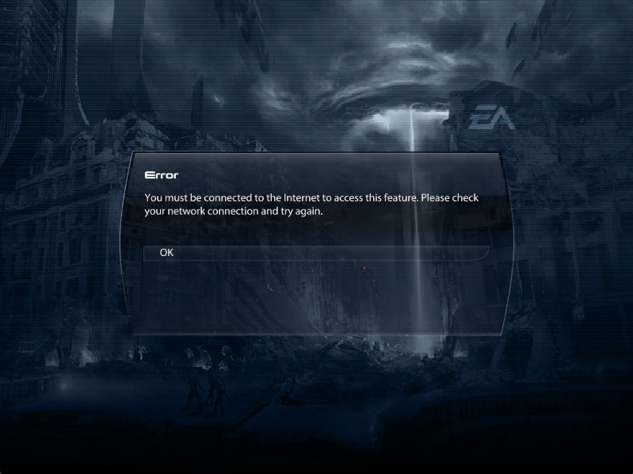

# ME3 Offline Plugin


[Discord Server (discord.gg/yvycWW8RgR)](https://discord.gg/yvycWW8RgR) | [Website (pocket-relay.pages.dev)](https://pocket-relay.pages.dev/)


## Table of Contents

- [What](#❔-what) What ME3 Offline Plugin is
- [Downloads](#📥-downloads) Download links to the plugin
- [Manually Building](#🚀-manually-building) Instructions for building manually
  - [Requirements](#requirements)
  - [1. Cloning sources](#1-cloning-sources)
  - [2. Adding rust target](#2-adding-rust-target)
  - [3. Building](#3-building)
  - [4. Done](#4-done)
- [License](#🧾-license) Project license

## ❔ What

This is a plugin which tricks the game into thinking you have an internet connection. This is useful if you're trying to
play an unofficial server while not being connected to the internet. Because the game checks whether you're actually connected
to Wifi/Ethernet of some sort when you go into multiplayer. So if you try and play multiplayer when you're not connected to a network even with Pocket Relay it won't work and the game shows you the following screen:



This plugin tricks the game into thinking you're still connected to a network allowing you to play multiplayer completely offline (As long as you've got your own server like Pocket Relay running)

## 📥 Downloads

Below is the download link for the plugin:

[Download](https://github.com/PocketRelay/me3-offline-plugin/releases/latest/download/me3-offline-plugin.asi)
s
## 🚀 Manually Building

If you would like to manually build the dll you can follow the instructions below

### Requirements
- Git (Optional, but required if you want to clone the repository rather than manually downloading, skip the git steps if you are not using it)
- Rust, Cargo, Rustup (Requires minimum Rust version of 1.70 may not compile on older versions, Rustup is required to add the required i86 target)
- MSVC / Microsoft C++ Build Tools https://learn.microsoft.com/en-us/windows/dev-environment/rust/setup

### 1. Cloning sources

Clone github repository (Skip this step if you have manually downloaded the sources)

```sh
git clone https://github.com/PocketRelay/me3-offline-plugin.git me3-offline-plugin
cd me3-offline-plugin
```

### 2. Adding rust target

You must add the following rust target to compile (The DLL requires being compiled for 32bit since the game is 32bit) you can add the target with the following rustup command

> This command only needs to be run for the first setup, and will be already installed for future builds

```sh
rustup target add i686-pc-windows-msvc
```

### 3. Building 

If you manually cloned the repository make sure you have cd'ed into the repository folder

```sh
cargo build --release
```

### 4. Done

The dll should now be built you can find it at

```
target/i686-pc-windows-msvc/release/pocket_relay_plugin.dll
```

## 🌐 EA / BioWare Notice

The **Pocket Relay** software, in all its forms, is not supported, endorsed, or provided by BioWare or Electronic Arts.

## 🧾 License

MIT License

Copyright (c) 2024 Jacobtread

Permission is hereby granted, free of charge, to any person obtaining a copy
of this software and associated documentation files (the "Software"), to deal
in the Software without restriction, including without limitation the rights
to use, copy, modify, merge, publish, distribute, sublicense, and/or sell
copies of the Software, and to permit persons to whom the Software is
furnished to do so, subject to the following conditions:

The above copyright notice and this permission notice shall be included in all
copies or substantial portions of the Software.

THE SOFTWARE IS PROVIDED "AS IS", WITHOUT WARRANTY OF ANY KIND, EXPRESS OR
IMPLIED, INCLUDING BUT NOT LIMITED TO THE WARRANTIES OF MERCHANTABILITY,
FITNESS FOR A PARTICULAR PURPOSE AND NONINFRINGEMENT. IN NO EVENT SHALL THE
AUTHORS OR COPYRIGHT HOLDERS BE LIABLE FOR ANY CLAIM, DAMAGES OR OTHER
LIABILITY, WHETHER IN AN ACTION OF CONTRACT, TORT OR OTHERWISE, ARISING FROM,
OUT OF OR IN CONNECTION WITH THE SOFTWARE OR THE USE OR OTHER DEALINGS IN THE
SOFTWARE.